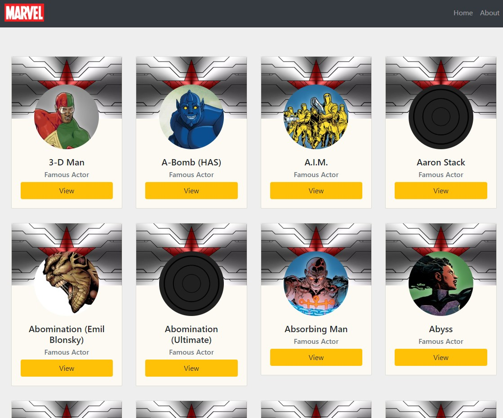

# Vuex Marvel API Explorer

### Description
The purpose of this project is to give you a basic understanding of state management using Vuex & Vue Router.
This app uses VueJS to call Marvel API (via Axios) and display a small amount of information (heroes, images, description...).

### Screenshots


### Install dependencies
```
$ npm install
```
### Serve with hot reload at localhost:8080
```
$ npm run serve
```

### Generate static project, get ready for launch on app services
```
$ npm run build
```

### Lints & fixes for files
```
$ npm run lint
```

### Customize configuration
See [Configuration Reference](https://cli.vuejs.org/config/).
